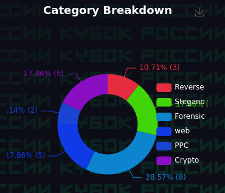
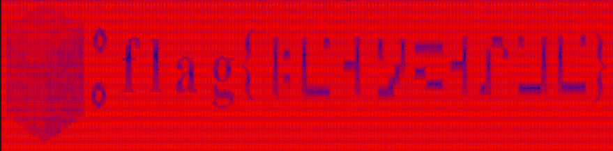
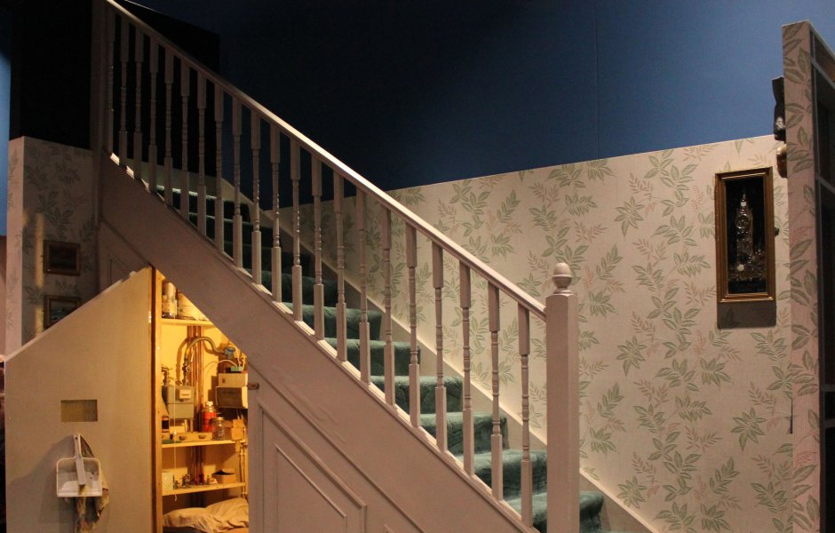
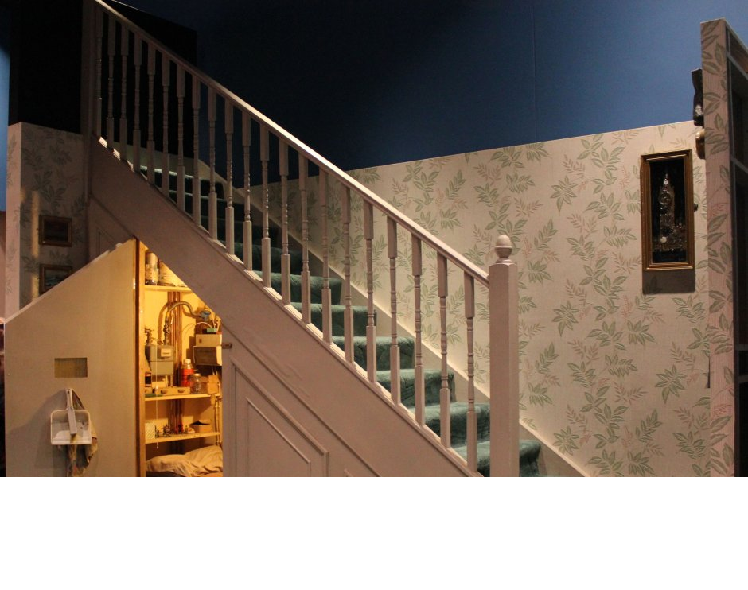
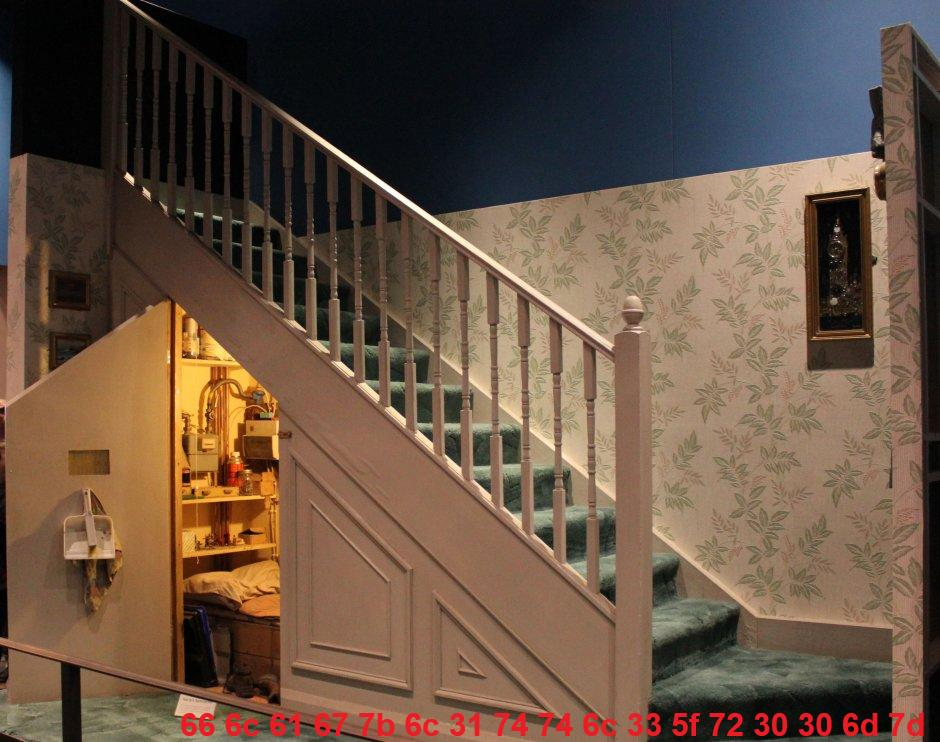

#  Очередная CTF подошла к концу
На днях мне посчастливилось поучавствовать в *Кубке России по программированию систем информационной безопасности*, и вместе с командой мы решили почти все задания, которые были представлены на площадке.

<div style="align: center;color: grey">
	
		<br>
	<p>решенные задачи</p>
</div>

**Хотелось бы поделиться решениями некоторых интересных задачек 😉**


## Содержание
- ### [Th3VSE](##Th3VSE)
- ### [Пиксели какие-то](##Пиксели%20какие-то)
- ### [Small room](##Small%20room)

## Th3VSE
Нам представлена страннаяя картинка и предлагается как-то найти в ней флаг:

<div style="align: center;color: grey">
	
		<br>
	<p>В файлах сервера старого аэропорта нашли странную фотографию, попробуй найти сообщение</p>
</div>

Я сразу же прошелся по ней утилитой `binwalk` и не стал искать какого-либо "скрытого смысла" в этой визуальной мешанине :)
`binwalk` сразу же вытащил из нее пару файликов:

<div style="align: center;color: grey"></div>

Прочитав `AL3RT.txt`, узнаем, что `ot-vinta` скорее всего аудиозапись `.wav`:
```text
П0сл#е сбоя в сист3^ме авиап0рта одн@ о*ч3нь в@жная а^уди0запись по$трад@ла, см0жешь починить?
Да? W@v3! # <-- Скорее всего мы будем работать с wave sound
```

К слову, пройдясь моим любимым `exiftool` по нашему таинстевнному файлу, можно узнать, что это `RIFF` контейнер, который как раз используется для мультимедиа!
```bash
ExifTool Version Number         : 13.10
File Name                       : ot-vinta_fin
Directory                       : .
File Size                       : 2.7 MB
File Modification Date/Time     : 2025:03:16 12:58:47+03:00
File Access Date/Time           : 2025:04:26 12:48:02+03:00
File Inode Change Date/Time     : 2025:04:26 12:43:14+03:00
File Permissions                : -rw-rw-r--
File Type                       : RIFF # <-- 
File Type Extension             : riff # <--
MIME Type                       : application/unknown
Encoding                        : Microsoft PCM
Num Channels                    : 2
Sample Rate                     : 48000
Avg Bytes Per Sec               : 192000
Bits Per Sample                 : 16
ID3 Size                        : 43
Software                        : Lavf58.29.100
Duration                        : 14.05 s
```

Тоже самое можно было сделать и через `Hex editor` :)
К слову, с ним как раз и пришлось поработать и заглянуть под капот аудио, ведь она была битая 😔
<div style="align: center;color: grey">
	
</div>

Данные по адресу `0x00000008-0x0000000B` неверны - там должен быть заголовок `WAVE`. Байт `7C` по адресу `0x00002008` тоже неправильный, если его **не поменять** на дефолтный `E4`, то проигрыватель скажет, что у него лапки: `OSError: invalid input stream` 
**P.S** *документацию по сигнатурам файлов можно найти [тут](https://en.wikipedia.org/wiki/List_of_file_signatures)*

Давайте поменяем сигнатуру файла и проверим работает ли:
<div style="align: center;color: grey">
	
</div>

Круто, сработало 🤩

<div style="align: center;color: grey"><p>Итоговое аудио</p></div>

Мое ухо сразу же заметило странный шум в аудио, а голову посетила мысль - нужно снять спектограмму аудио. И да, я был прав!
<div style="align: center;color: grey">
	
</div>

Так как я достаточно играл в `Minecraft`, то сразу же узнал родной шрифт чаровального столика :)
А для тех кто мало знаком с игрой, слева висит жирная подсказка - сам символ Майнкрафта

Гуглим `"Minecraft enchanting table to english"` и сопоставляем символы из спектограммы с символами чаровального столика из игры

Вуаля, получаем флаг:
```
flag{LEGENDGAME}
```
## Пиксели какие-то
Очередная стеганограмма. Не могу выложить фото, тк оно весит аж 183мб 😨
Я даже не стал открывать его, иначе из моего ноута начал бы выходить "волшебный дым", а сразу же прошелся старым добрым `binwalk` 😉

*"Бинарный ходитель* 😁 *"* смог вытащить оттуда несколько файликов:
<div style="align: center;color: grey">
	
</div>
Два первых файлика - пустые, а вот `decoder.py` выглядит вполне интересным (я достал его из `RAR`ника)
Попробуем запустить

```bash
$ python3 decoder.py
Traceback (most recent call last):
  File "/home/segfault/ctf/kubok_rossii_2025/stega/_after.png.extracted/decoder.py", line 22, in <module>
    decoded_data = decode_subpixel("after.png", int(1000))
  File "/home/segfault/ctf/kubok_rossii_2025/stega/_after.png.extracted/decoder.py", line 4, in decode_subpixel
    img = Image.open(image_path).convert("RGB")
  File "/usr/lib/python3/dist-packages/PIL/Image.py", line 984, in convert
    self.load()
    ~~~~~~~~~^^
  File "/usr/lib/python3/dist-packages/PIL/ImageFile.py", line 319, in load
    raise _get_oserror(err_code, encoder=False)
OSError: broken data stream when reading image file
```

Быстро пошерстив интернет, я понял что какие-то пиксели в изображении могут быть утеряны, и `PIL` это не нравится. Добавив в код быстрый фикс *(Игнорирование битых пикселей :D)* все сработало и я получил флаг
```
$ python3 decoder.py
Decoded: flag{d@_V@ny@_y@_n@ch@a1_d3l@t_t@a5ki)))}ÀO¶" FxÙËu`%gv
                                                                õ~Lf	Ü2Ç_ÐÊ®¯
                                                                                >QH ×@	Zv¿×½Ù§ùT[sÔü@ÓµÑo´ËKz0>çBO*lÙuúªq±éB·è[Ûd(Ëtí#¥+È·k$n/·|l␦RLWµ"íÅCP4¹¾@òqæï:
                                                  wÁ×ÞNGn
                                                         ª=¤â.98
                                                                #)
                                                                  æ­òsH¢´Ù£ÚäáOr«ôæîØ;TLï Êñfó]ÏϽ	ý´÷¢ªªro\ëã٢ĴSRh­Ê-öÑäèWT»Ý}Þê»/Hjâ{Y?>+QÄ	Öp&␦©µFã
Ó¾U(=ZÏ»¿Ä÷£lC-Êìñ,wT*ÄjÜu­»¢G␦ÐQ5Â\PÐ÷HL¥,5ÂT°p)×ÆERwAîé¨2ÅM°s1úXsÅATJÂð¯Ã1búVXú~ɾ¸·0`|ã}Ý{Ðr^o×
                                                                                                  e9D0e?p)3­
"äîCaju§7B]
           åÞáÝX¸ÅyGsÄO...

```

Сам `decoder.py` после фикса выглядел вот так:
```python
from PIL import Image, ImageFile

def decode_subpixel(image_path, data_length):
    ImageFile.LOAD_TRUNCATED_IMAGES = True # <-- FIX
    img = Image.open(image_path).convert("RGB")
    pixels = img.load()
    width, height = img.size
    secret_bits = []
    count = 0

    for y in range(height):
        for x in range(width):
            r, g, b = pixels[x, y]
            secret_bits.append(str(r & 1))
            secret_bits.append(str(g & 1))
            secret_bits.append(str(b & 1))
            count += 3
            if count >= data_length * 8:
                secret_bytes = [int(''.join(secret_bits[i:i+8]), 2) for i in range(0, data_length*8, 8)]
                return ''.join(chr(byte) for byte in secret_bytes)
    return ""

decoded_data = decode_subpixel("after.png", int(1000))
print("Decoded:", decoded_data)
```
## Small room
К слову, это  ~~была~~ должна была быть самая простая стега, но с ней я изрядно намучался 😔

На вход нам подается битый `png` файл. После его восстановления (я сделал это онлайн), мы видим нормальную картинку


К слову, нага задача здесь - найти ключ. Видите его? Вот и я нет :D
Зато увидеть его поможет наш любимый `HEX` редактор 🙃

Заглядываем внутрь и сразу видим интересные строчки: `Comment 940 no 742 = pobeda`
<div style="align: center;color: grey">
	
</div>

Значит изменяем размер изображения (тоже с помощью хекс редактора) и пересчитываем `CRC` сумму, иначе фотка не откроется
<div style="align: center;color: grey">
	
</div>

Здесь я и засел... Получилось следующее:


Возникла какая-то проблема с аллокацией байтов. В итоге задание дорешал мой товарищ (измненив какой-то заголовок) и получилась такая картинка:


Здесь уже нет ничего сложного - остается зайти в любой декодер `HEX` в строки и получить флаг: `flag{l1ttl3_r00m}`

---
> [!Important]
> Пока что все, со временем обновлю **README**, добавлю еще решений!!

*by CacucoH*